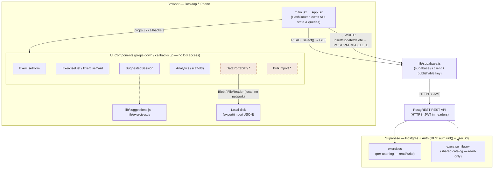

# Architecture — Resistance Training Tracker (v1)

This document describes the architecture of **version 1** of the Resistance Training Tracker.
It is the baseline we will build enhancements on top of.

Live app: <https://learningwithsnoopy101.github.io/resistance-training-tracker>

---

## Overview

A React 18 + Vite single-page app, hosted as a static bundle on **GitHub Pages**, that
reads and writes a user's training log to **Supabase** (managed PostgreSQL + Auth).
All data access is funneled through `App.jsx`; child components never talk to the
database directly — they receive data via props and send changes up via callbacks.

**Tech stack**

- React 18 + Vite
- React Router v7 (HashRouter — GitHub Pages friendly)
- Tailwind CSS
- `@supabase/supabase-js` (the only external/network dependency)
- GitHub Pages (static hosting, deployed via `gh-pages`)

---

## Component & data-flow diagram

`*` = present in the repo but **not currently wired into `App.jsx`** (see Known gaps).

---

## Integration points

There is **one external integration** plus two local/build-time boundaries.

### 1. Supabase (the only runtime external integration)

Access is **via the Supabase REST API**, not a direct database connection. The app calls
the `supabase-js` client (`supabase.from('exercises').select()/.insert()/...`), and the
client translates each call into an HTTPS request against Supabase's auto-generated
**PostgREST** endpoint at the project URL. Auth travels as a JWT in the request headers;
**row-level security** (`auth.uid() = user_id`) enforces per-user isolation server-side,
which is why the publishable key is safe to ship in client code.

- **Reads** (on login): `fetchExercises()` and `fetchExerciseLibrary()` → `GET`
- **Writes**: `handleAddExercise` (insert/update), `handleDeleteExercise` (delete) → `POST`/`PATCH`/`DELETE`
- **Translation layer**: `fromDb()` / `toDb()` map between snake_case DB columns and the camelCase app shape; `toDb()` stamps `user_id` from the session.
- **Auth gate**: `getSession()` + `onAuthStateChange()` decide whether any data loads at all.
- Not used: Supabase realtime websockets, GraphQL.

### 2. Local file import/export (browser-only, no network)

`DataPortability` exports the in-memory log to a JSON file (`Blob` + download) and reads
files back via `FileReader`. `BulkImport` parses pasted notepad-style rows. Both are for
backup/ownership and bulk entry. **No server is involved.**

### 3. GitHub Pages (build-time only)

`npm run deploy` builds the static bundle and publishes it via `gh-pages`. The running
app does not talk to GitHub at runtime.

---

## Known gaps (v1 → carried into v2 planning)

- **Import is not yet wired up.** `DataPortability` and `BulkImport` both parse input and
  call an `onImport(data)` prop, but `App.jsx` does not import/mount them and defines no
  `onImport` handler. So **export works, but import does not persist to Supabase** today.
  Wiring it up means: add an `onImport` handler in `App.jsx` that maps rows through `toDb()`
  and batch-inserts to `exercises`, mount the components on the Log tab, and decide dedupe behavior.
- **Analytics is a scaffold** — charts are the next major build step.
- **Data-access queries are inlined in `App.jsx`.** As the app grows, extracting them into a
  `lib/db.js` module (or adopting React Query for caching/refetch) would keep `App` from
  becoming a bottleneck.

---

*Generated as the v1 baseline. Update the Mermaid block above as the architecture evolves.*
